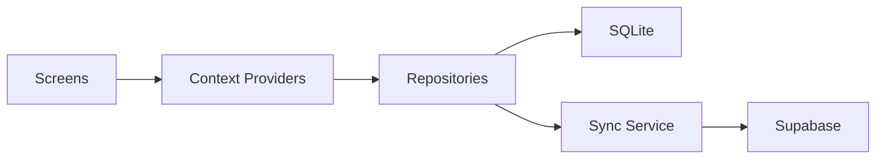

# HealthRecApp

HealthRecApp is an offline-first personal health tracking app built with React Native. It helps users log daily health data such as sleep, hydration, mood, diet, symptoms, activity, and steps. Data is stored locally in SQLite and automatically synced to Supabase when an internet connection is available.

The app prioritizes Android and includes a native step-tracking service that continues recording steps even when the app is not open. The project is designed with a modular structure, making it easy to maintain and extend.

## Features

- User authentication with Supabase
- Daily health logging (sleep, hydration, mood, diet, symptoms)
- Activity tracking with calorie estimation
- Android native step counter service
- Nutrition scanning from food images
- Symptom checker powered by external AI services
- Local insights and trend analysis
- Offline-first storage with automatic cloud sync

## Tech Stack

- React Native
- TypeScript
- React Navigation
- SQLite (`react-native-sqlite-storage`)
- Supabase (Auth + Sync)
- AsyncStorage
- Kotlin (Android step tracking)
- Jest, ESLint, Prettier

## Architecture

The app follows a simple data flow:



## Main Directories

- [App.tsx](App.tsx) - Entry point
- [screens/](screens/) - Feature screens
- [components/](components/) - Reusable UI components
- [context/](context/) - Global state (auth, health data)
- [repositories/](repositories/) - SQLite data layer
- [services/](services/) - Business logic and API calls
- [types/](types/) - Shared TypeScript types
- [navigation/](navigation/) - App navigation setup
- [android/](android/) - Native Android code (step tracking)
- [ios/](ios/) - iOS project
- [supabase/](supabase/) - Database schema
- [__tests__/](__tests__/) - Tests


## Core Modules

### Authentication
Handles user sign-in, sign-up, and session management using Supabase.

### Health Logging
Tracks daily health metrics and stores them locally for offline use.

### Activity Tracking
Logs workouts and estimates calories, combining activity and step data.

### Step Tracking (Android)
Uses a native foreground service and sensor APIs to track steps in the background.

### Nutrition Scan
Analyzes food images and returns nutrition insights using external APIs.

### Symptom Checker
Provides symptom-based guidance. Not intended as medical advice.

### Insights
Generates summaries, trends, and streaks from user data locally.

### Sync Engine
Queues offline changes and syncs them to Supabase when online.

## Getting Started

```bash
npm install
npx react-native start
npm run android
```
